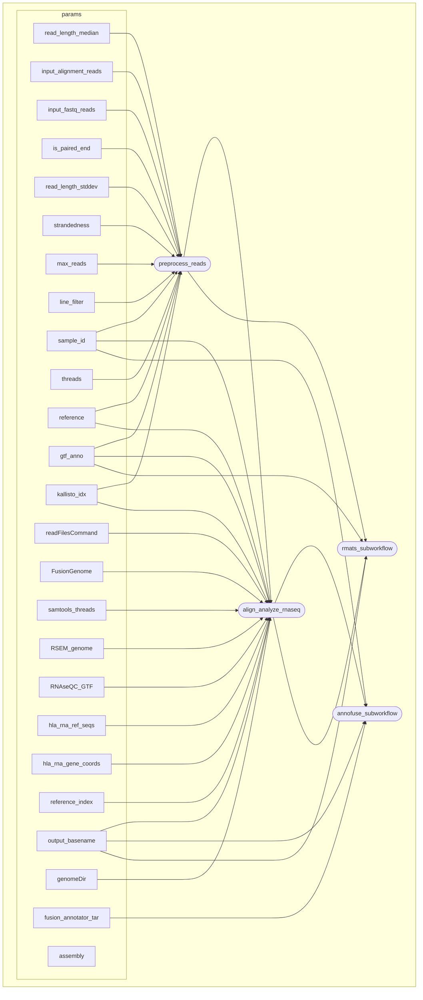

# Kids First RNAseq Nextflow
This repo is currently a dev project of converting our CWL production workflow to Nextflow.
Once development has complete, it will become a prod product.

  

  

## Current State
The workflow is in alpha production shape.
Currently, you __cannot__ mix single and and paired end data with this workflow.
In the `test_inputs` dir, there are examples of various input situations that have been tested.
It can now run on CAVATICA, you can push this app by:
 - [Install sbpack](https://docs.cavatica.org/docs/bring-nextflow-apps-to-cavatica#about-sbpack)
 - Using command `sbpack_nf --profile {your_profile} --appid {username}/{project}/kfdrc-rnaseq-nextflow --workflow-path /path/to/this/repo/Kids-First-RNAseq-Nextflow/ --entrypoint main.nf --sb-schema sb_nextflow_schema.yaml`

## Preprocess Reads Subworkflow:
The workflow takes in a mix of alignment files (BAM/CRAM) and fastq (single or paired end) and does the following:
### Alignment input
1. Split by read group
1. Create STAR read group strings
1. Convert to FASTQ
1. Run cutadapt if a cutadapt-related param is given
1. Return an object with STAR RG strings and related fastqs for downstream processing

### FASTQ input
1. Reformat to match object created by alignment input
1. Run cutadapt if a cutadapt-related param is given
### Result
Return an object with STAR RG strings and related fastqs coming from the alignment input and/or fastq input for downstream processing and the added_metadata with the following:
   - Paired end flag
   - Read length median
   - Read length std dev
   - Strandedness

## Align Analyze RNAseq
 - STAR Align
 - STAR Fusion
 - Arriba Fusion
 - T1K
 - RNASeQC
 - Kallisto

## annoFuse Subworkflow
 - Format Arriba
 - Annotate Arriba
 - Collate, filter, and annotate Arriba + Fusion results (annoFuse)

## T1K Subworkflow
 - Run T1K
 - Filter results
# DAGS

## Main WF

## [Preprocess Reads](docs/dags/PREPROCESS_READS_SUBWF.md)

## [Align Analyze RNAseq](docs/dags/ALIGN_ANALYZE_RNASEQ_SUBWF.md)

## [annoFuse Subworkflow](docs/dags/ANNOFUSE_SUBWORKFLOW.md)

## [rMATS Subworkflow](docs/dags/RMATS_SUBWORKFLOW.md)
