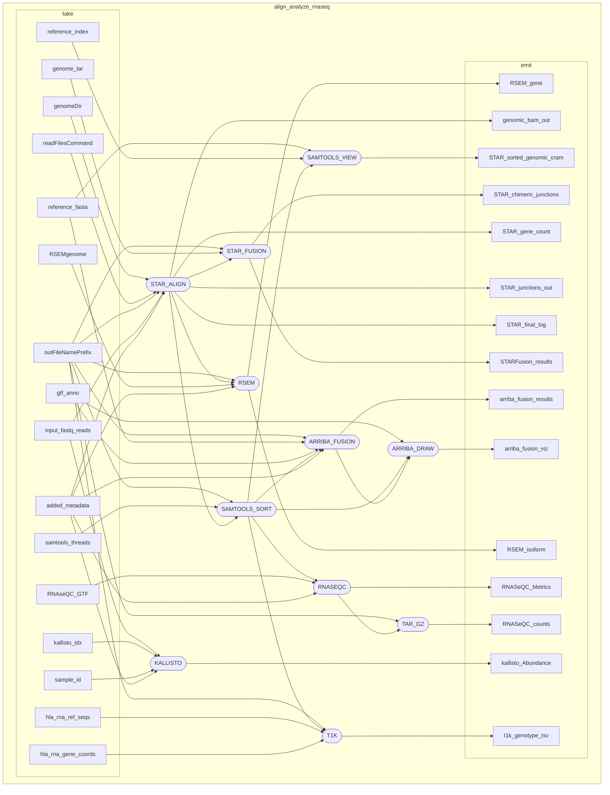

# Align and Anaylze RNAseq Subworkflow

```mermaid
flowchart TB
    subgraph align_analyze_rnaseq
    subgraph take
    v4["genome_tar"]
    v7["reference_index"]
    v11["sample_id"]
    v2["outFileNamePrefix"]
    v9["RSEMgenome"]
    v14["hla_rna_gene_coords"]
    v12["RNAseQC_GTF"]
    v3["input_fastq_reads"]
    v0["genomeDir"]
    v13["hla_rna_ref_seqs"]
    v1["readFilesCommand"]
    v8["gtf_anno"]
    v5["samtools_threads"]
    v15["added_metadata"]
    v6["reference_fasta"]
    v10["kallisto_idx"]
    end
    v22([STAR_ALIGN])
    v23([STAR_FUSION])
    v24([SAMTOOLS_SORT])
    v26([KALLISTO])
    v28([ARRIBA_FUSION])
    v29([ARRIBA_DRAW])
    v30([RSEM])
    v31([RNASEQC])
    v32([TAR_GZ])
    v33([T1K])
    v35([SAMTOOLS_VIEW])
    subgraph emit
    v46["RSEM_gene"]
    v48["RNASeQC_counts"]
    v45["RSEM_isoform"]
    v39["STAR_gene_count"]
    v49["kallisto_Abundance"]
    v40["STAR_junctions_out"]
    v50["t1k_genotype_tsv"]
    v36["genomic_bam_out"]
    v47["RNASeQC_Metrics"]
    v43["arriba_fusion_results"]
    v41["STAR_final_log"]
    v42["STARFusion_results"]
    v37["STAR_sorted_genomic_cram"]
    v44["arriba_fusion_viz"]
    v38["STAR_chimeric_junctions"]
    end
    v0 --> v22
    v1 --> v22
    v2 --> v22
    v3 --> v22
    v15 --> v22
    v2 --> v23
    v4 --> v23
    v22 --> v23
    v2 --> v24
    v5 --> v24
    v22 --> v24
    v3 --> v26
    v10 --> v26
    v11 --> v26
    v15 --> v26
    v2 --> v28
    v6 --> v28
    v8 --> v28
    v24 --> v28
    v15 --> v28
    v8 --> v29
    v24 --> v29
    v28 --> v29
    v2 --> v30
    v22 --> v30
    v9 --> v30
    v15 --> v30
    v24 --> v31
    v12 --> v31
    v15 --> v31
    v2 --> v32
    v31 --> v32
    v2 --> v33
    v24 --> v33
    v13 --> v33
    v14 --> v33
    v6 --> v35
    v7 --> v35
    v24 --> v35
    v22 --> v36
    v35 --> v37
    v23 --> v38
    v22 --> v39
    v22 --> v40
    v22 --> v41
    v23 --> v42
    v28 --> v43
    v29 --> v44
    v30 --> v45
    v30 --> v46
    v31 --> v47
    v32 --> v48
    v26 --> v49
    v33 --> v50
    end
```