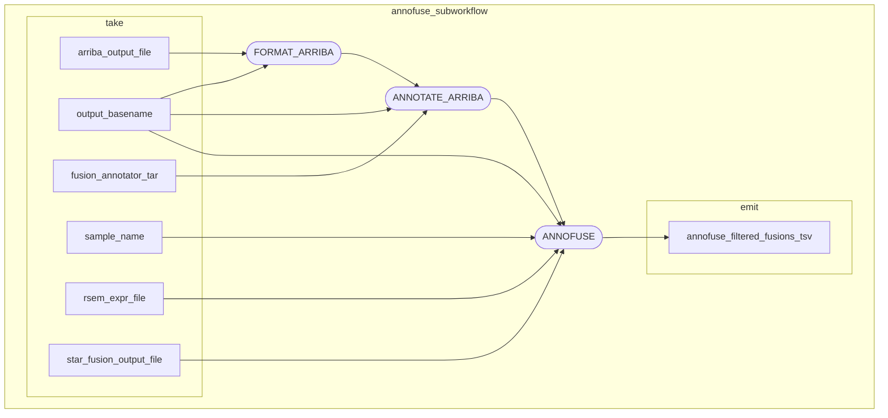

# annoFuse Subworkflows

```mermaid
flowchart TB
    subgraph annofuse_subworkflow
    subgraph take
    v3["rsem_expr_file"]
    v5["output_basename"]
    v2["fusion_annotator_tar"]
    v4["star_fusion_output_file"]
    v0["arriba_output_file"]
    v1["sample_name"]
    end
    v6([FORMAT_ARRIBA])
    v7([ANNOTATE_ARRIBA])
    v8([ANNOFUSE])
    subgraph emit
    v9["annofuse_filtered_fusions_tsv"]
    end
    v0 --> v6
    v5 --> v6
    v2 --> v7
    v5 --> v7
    v6 --> v7
    v1 --> v8
    v3 --> v8
    v4 --> v8
    v5 --> v8
    v7 --> v8
    v8 --> v9
    end
```