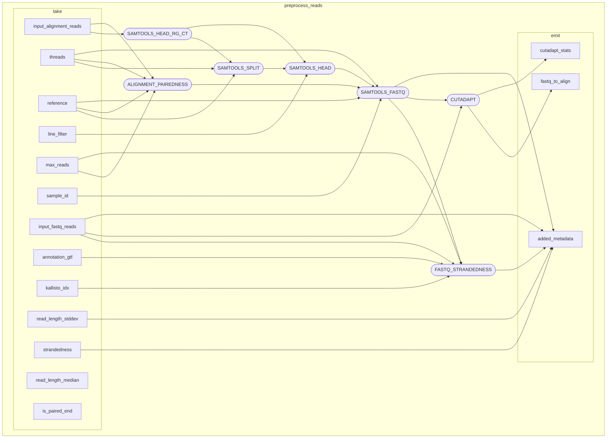

# Preprocess Reads Subworkflow

```mermaid
flowchart TB
    subgraph preprocess_reads
    subgraph take
    v4["read_length_median"]
    v8["sample_id"]
    v9["threads"]
    v3["is_paired_end"]
    v11["annotation_gtf"]
    v5["read_length_stddev"]
    v10["reference"]
    v7["max_reads"]
    v1["input_fastq_reads"]
    v2["line_filter"]
    v6["strandedness"]
    v12["kallisto_idx"]
    v0["input_alignment_reads"]
    end
    v14([SAMTOOLS_HEAD_RG_CT])
    v18([SAMTOOLS_SPLIT])
    v20([SAMTOOLS_HEAD])
    v22([ALIGNMENT_PAIREDNESS])
    v25([SAMTOOLS_FASTQ])
    v30([FASTQ_STRANDEDNESS])
    v38([CUTADAPT])
    subgraph emit
    v42["added_metadata"]
    v41["cutadapt_stats"]
    v40["fastq_to_align"]
    end
    v0 --> v14
    v9 --> v18
    v10 --> v18
    v14 --> v18
    v2 --> v20
    v18 --> v20
    v14 --> v20
    v0 --> v22
    v7 --> v22
    v9 --> v22
    v10 --> v22
    v20 --> v25
    v22 --> v25
    v8 --> v25
    v9 --> v25
    v10 --> v25
    v1 --> v30
    v7 --> v30
    v25 --> v30
    v11 --> v30
    v12 --> v30
    v1 --> v38
    v25 --> v38
    v38 --> v40
    v38 --> v41
    v1 --> v42
    v5 --> v42
    v6 --> v42
    v25 --> v42
    v30 --> v42
    end
```