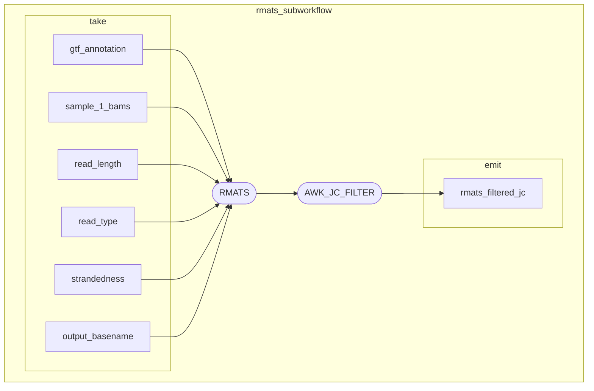

# rMATS Subworkflow

```mermaid
flowchart TB
    subgraph rmats_subworkflow
    subgraph take
    v1["sample_1_bams"]
    v3["read_type"]
    v4["strandedness"]
    v5["output_basename"]
    v0["gtf_annotation"]
    v2["read_length"]
    end
    v6([RMATS])
    v8([AWK_JC_FILTER])
    subgraph emit
    v9["rmats_filtered_jc"]
    end
    v0 --> v6
    v1 --> v6
    v2 --> v6
    v3 --> v6
    v4 --> v6
    v5 --> v6
    v6 --> v8
    v8 --> v9
    end
```